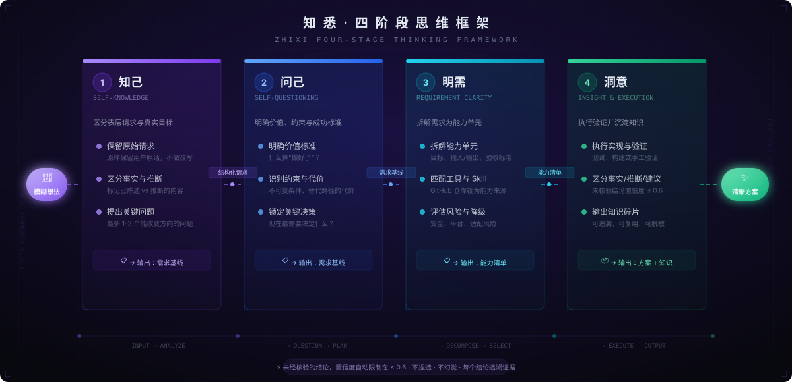

<div align="center">

# 知悉 ZHIXI

### 把模糊想法转成清晰行动，留下可追溯、可复用的知识

**Turn Vague Ideas Into Clear Actions, Leave Traceable Knowledge**

[](./LICENSE)
[](./CHANGELOG.md)
[](https://docs.qoder.com/qoderwork/introduction)
[](./CONTRIBUTING.md)

[中文](#关于) | [English](#english) | [快速开始](#快速开始) | [示例](./examples/)

</div>

---

## 关于

**知悉（ZHIXI）** 是一个 AI Agent 技能，弥合"你以为自己想要的"和"你真正需要的"之间的鸿沟。它运行一套结构化四阶段思维框架，把模糊请求转化为可执行方案——并定义了一套知识沉淀格式，帮助你留下可复用的知识。

大多数 AI 对话始于一个模糊提示，终于一个半成品答案。知悉改变了这一点：在每一步强制澄清——理解真实目标、审视假设、拆解能力单元、用可追溯的证据执行。

**一套可独立使用的结构化思维方法论，无需额外 API Key，无额外依赖。**

---

## 核心特性

- **四阶段思维框架** — 从理解到执行的结构化流程，不跳过任何步骤
- **知识沉淀格式** — 定义了可追溯、可复用的知识碎片格式及置信度评分（存储基础设施由用户自建）
- **Agent 协作感知** — 包含多 Agent 交接指引
- **零额外依赖** — 不需要额外的 API、不需要额外的密钥，适配工作空间支持的任何 LLM
- **意图保留** — 你的原始请求始终原样保留，不会被悄悄改写
- **证据导向** — 每个结论标记为事实 / 推断 / 建议，并追踪来源

---

## 工作原理

<p align="center">
  
</p>

<details>
<summary>纯文本版流程图（不支持 SVG 时查看）</summary>

```
💭 模糊想法 → [🔍 知己] → 结构化请求 → [❓ 问己] → 需求基线 → [📐 明需] → 能力清单 → [💡 洞意] → ✨ 清晰方案 + 知识碎片
```

</details>

<table>
<tr>
<td width="25%" align="center" valign="top">

<br/>

**🔍 知己**

*Self-Knowledge*

</td>
<td width="25%" align="center" valign="top">

<br/>

**❓ 问己**

*Self-Questioning*

</td>
<td width="25%" align="center" valign="top">

<br/>

**📐 明需**

*Requirement Clarity*

</td>
<td width="25%" align="center" valign="top">

<br/>

**💡 洞意**

*Insight & Execution*

</td>
</tr>
<tr>
<td valign="top">

📝 保留原始请求

🔬 区分事实与推断

❓ 提出 1-3 个关键问题

</td>
<td valign="top">

⚖️ 明确价值与成功标准

🚧 识别约束与代价

🎯 锁定下一项关键决策

</td>
<td valign="top">

🧩 拆解为能力单元

🔧 匹配工具与 Skill

🛡️ 评估风险与降级路径

</td>
<td valign="top">

⚙️ 执行实现与验证

🧪 区分事实/推断/建议

📦 输出可追溯知识碎片

</td>
</tr>
<tr>
<td align="center">

*→ 输出：需求基线*

</td>
<td align="center">

*→ 输出：需求基线*

</td>
<td align="center">

*→ 输出：能力清单*

</td>
<td align="center">

*→ 输出：方案 + 知识*

</td>
</tr>
</table>

> **未经核验的结论，置信度自动限制在 ≤ 0.6。** 不捏造，不幻觉，每个结论追溯证据。

---

## 快速开始

### 前置要求

- 一个支持自定义 System Prompt 的 AI 环境（QoderWork、Cursor、Cline、Claude Desktop 等均可）
- 已配置可用的 LLM（知悉适配任何模型，不挑后端）

### 安装（QoderWork）

如果你使用 QoderWork，将 `skill/SKILL.md` 复制到技能目录即可：

```bash
# macOS / Linux
mkdir -p ~/.qoderworkcn/skills/zhixi
cp skill/SKILL.md ~/.qoderworkcn/skills/zhixi/SKILL.md
```

```powershell
# Windows (PowerShell)
New-Item -ItemType Directory -Force -Path "$env:USERPROFILE\.qoderworkcn\skills\zhixi"
Copy-Item "skill\SKILL.md" "$env:USERPROFILE\.qoderworkcn\skills\zhixi\SKILL.md"
```

2. 完成。无需任何配置。

### 其他环境

如果你不使用 QoderWork，可以直接把 `skill/SKILL.md` 的内容粘贴到任何 AI 工具的 System Prompt 中，或者在对话开始时发送全文作为上下文。知悉的核心是一份结构化提示词，不依赖任何特定平台的功能。

### 使用方式

在任意对话中，直接说：

> **知悉** — 我想做一个 [你的想法]

也可以用英文触发：

> **zhixi** — I want to build [your idea]

知悉会自动启动四阶段框架，带你一步步理清思路。

### 示例场景

```
知悉 — 我想做一个个人记账工具，能自动分类支出、生成月度报告
知悉 — 帮我理清思路，我想在团队内推广代码审查流程，但不知道怎么开始
知悉 — 我想给公司写一个内部知识库，把散落的文档和经验整合起来
需求澄清 — 我打算用 Rust 重写一个高性能日志收集器，帮我拆解需求
意图分析 — 我要做一个面向老年人的健康管理 App，帮我分析可行性
```

### 什么时候该用知悉？

| ✅ 适合 | ❌ 不适合 |
|---------|----------|
| 把模糊想法转化为可执行方案 | 简单的事实问答（"Python 怎么读文件"） |
| 长程任务拆解和规划 | 一句话就能解决的请求（"帮我格式化这段 JSON"） |
| 有明确目标但路径不清 | 纯闲聊或发散式讨论 |
| 需要多角度权衡的决策 | 已有完整方案只需执行 |
| 跨会话知识沉淀 | 一次性、不需要复用的操作 |

> **简单判断：** 如果你需要 AI 帮你**想清楚**再动手，用知悉。如果你已经知道要做什么、只需要 AI 帮你**做**，直接说就好。

### 一次完整对话是什么样的？

> **知悉** — 我想做一个本地优先的个人记账工具，能自动分类支出、生成月度报告

<table>
<tr>
<td width="25%" valign="top">

<br/>

**🔍 知己** · 理解意图

<br/>

💭 *原始请求*

「本地记账、自动分类、月度报告、Markdown 数据」

🔬 *区分事实与推断*

- ✓ 陈述：本地优先
- ⚠️ 推断：注重数据隐私
- ⚠️ 推断：习惯 Markdown 工作流

❓ *三个改变方向的问题*

1. 手动输入还是导入流水？
2. 大类够用还是要二级分类？
3. 只看汇总还是要预算对比？

</td>
<td width="25%" valign="top">

<br/>

**❓ 问己** · 锁定需求

<br/>

⚖️ *成功标准*

每日记账 < 2 分钟，分类准确率 > 95%

🚧 *约束*

- 数据全本地，零网络依赖
- Markdown 格式，人可读

🎯 *非目标*

- ✗ 不做移动端 App
- ✗ 不做多人共享
- ✗ 不做银行流水导入

📋 *当前决策*

先跑通最小流程，再扩展

</td>
<td width="25%" valign="top">

<br/>

**📐 明需** · 拆解能力

<br/>

🧩 *能力单元 ×3*

**录入** — 一条命令追加记录

**分类** — 关键词字典自动匹配

**报告** — 汇总表 + 预算达成率

🔧 *工具选型*

Python CLI · 纯标准库 · 零依赖

🛡️ *降级路径*

分类未命中 → 归入"其他"

网络不可用 → 不受影响（纯本地）

📦 *知识槽位*

`Markdown 数据格式设计` → 待验证

</td>
<td width="25%" valign="top">

<br/>

**💡 洞意** · 交付知识

<br/>

⚙️ *数据格式设计*

```
---
month: 2026-07
budget: 8000
---
| 日期  | 金额 | 分类 | 描述 |
|-------|------|------|------|
| 07-01 | 35   | 餐饮 | 午餐 |
```

🧪 *CLI 接口*

`book add 35 "午餐"` → 自动分类

`book report` → 月度报告

📦 *知识碎片*

confidence: 0.6（未核验）

可追溯 · 可复用 · 可脱敏

</td>
</tr>
</table>

<div align="center">

*一句模糊想法 → 结构化需求基线 → 可执行能力拆解 → 带置信度的知识沉淀*

</div>

### 触发词

以下任意关键词均可激活知悉：`知悉`、`zhixi`、`知己`、`问己`、`明需`、`洞意`、`四阶段流程`、`知悉式任务拆解`、`把想法变清晰`、`帮我理清思路`、`需求澄清`、`意图分析`

---

## 知识沉淀

知悉定义了知识沉淀的格式规范——它规定知识碎片**应该长什么样**，但不负责**存在哪里**。

> **重要说明：** 知悉是一套方法论和格式规范。它**不包含**内置的知识存储引擎、数据库或搜索系统。知识碎片格式的设计目标是让你用自建或自选的基础设施来存储、索引和查询。

### 知识槽位（第三阶段生成）

```json
{
  "id": "slot-1-node-id",
  "title": "需要知道什么",
  "question": "执行完成后需要回答的单一问题",
  "kind": "procedure",
  "targetNodeId": "node-id",
  "requiredEvidence": ["实际执行结果", "来源或文件路径", "适用边界"],
  "destinationHint": "inbox"
}
```

支持的 `kind` 类型：`principle`、`procedure`、`decision_rule`、`data_contract`、`verified_finding`、`risk_boundary`、`open_question`

### 知识碎片（第四阶段生成）

每个碎片是一份独立的、脱敏的 Markdown 文档，带 YAML 前言：

```markdown
---
type: knowledge-fragment
status: candidate
privacy: sanitized
source: "来源 URL 或描述"
confidence: 0.8
tags:
  - knowledge/fragment
---

# 可独立复用的标题

## 摘要
## 事实陈述
## 推断
## 建议
## 适用边界
## 来源
```

不捏造，不幻觉，每个结论追溯证据。

### 自建知识库

碎片格式的设计特点：

- **文件化** — 每个碎片是独立的 Markdown 文件，可以存在任何地方
- **可检索** — YAML 前言支持任何文本搜索工具索引
- **可迁移** — 在系统间迁移碎片时不产生锁定

你可以把碎片存在 Git 仓库、笔记应用、静态站点中，或者在其上构建自定义搜索索引。格式始终不变。

### 设想：理想化的知识库是什么样？

> **声明：** 以下是知悉知识碎片格式的**理想化应用场景**，作者本人尚未搭建和实现任何配套工具或知识库系统。这里描述的是这套格式**有能力支撑**的方向，属于明需阶段理论推演的产物，供有兴趣的开发者参考。

想象这样的使用场景：

```
knowledge/
├── inbox/                          ← 新碎片自动归入
│   └── 2026-07-28-pdf-parser.md
├── tech-evaluation/                ← 技术评估类
│   ├── pdf-parser-chinese.md       (confidence: 0.85)
│   └── async-vs-sync-for-io.md     (confidence: 0.70)
├── architecture/                   ← 架构决策类
│   └── event-driven-vs-request.md  (confidence: 0.90)
├── decision-rules/                 ← 决策规则类
│   └── pdf-library-selection.md    (confidence: 0.90)
└── deprecated/                     ← 已过时
    └── old-api-endpoint-map.md     (replaced by: new-api-v3.md)
```

如果有开发者愿意在此基础上构建配套工具——比如扫描目录、校验 frontmatter、按 `kind` 和 `tags` 索引、追踪置信度——那将是这套格式的理想归宿。但目前这些都还不存在。

但这些都是格式之上的**上层建筑**。知悉本身只定义格式——保证碎片"长什么样"，不规定"存在哪里"和"怎么管理"。

---

## 架构

```
┌─────────────────────────────────────────────────────┐
│                    宿主会话                            │
│                                                     │
│  ┌──────────┐  ┌──────────┐  ┌──────────┐  ┌─────┐│
│  │  知己    │→ │  问己    │→ │  明需    │→ │ 洞意 ││
│  │          │  │          │  │          │  │     ││
│  │ 意图分析  │  │ 需求基线  │  │ 能力拆解  │  │执行  ││
│  │          │  │          │  │          │  │+知识 ││
│  └──────────┘  └──────────┘  └──────────┘  └─────┘│
│        ↕             ↕             ↕           ↕   │
│  ┌─────────────────────────────────────────────────┐│
│  │          知识碎片格式输出                         ││
│  │       （存储基础设施：用户自建）                    ││
│  └─────────────────────────────────────────────────┘│
└─────────────────────────────────────────────────────┘
```

知悉完全在宿主会话内运行，跟随宿主选择的模型，不调用任何外部服务。

---

## 示例

查看 [examples/](./examples/) 目录了解真实用法：

- [从模糊想法到行动方案](./examples/vague-idea-to-action.md) — 把一个粗略的产品想法转化为结构化方案
- [知识碎片示例](./examples/knowledge-fragment-example.md) — 沉淀出的知识碎片长什么样
- [团队流程改进](./examples/team-process-improvement.md) — 在抵触、时间压力和工具争议下推广代码审查
- [高级知识碎片](./examples/advanced-knowledge-fragments.md) — 多种 `kind` 类型的碎片：风险边界、开放问题、决策规则、已弃用

---

## 知悉适合你吗？

知悉适合需要对复杂、多步骤问题进行结构化思考的场景。以下情况可能**不太合适**：

- 你需要快速的一句话事实回答——直接问 AI 就好
- 你的工作流不需要显式的需求拆解
- 你在找一个全自动的知识管理系统（知悉定义格式，基础设施需要自建）

### 为什么选择知悉？

| 痛点 | 没有知悉 | 用知悉 |
|------|---------|-------|
| 提示模糊 | AI 靠猜，你重试 5 遍 | 一次结构化澄清 |
| 上下文丢失 | 每次对话从零开始 | 知识碎片跨会话延续 |
| 未核验结论 | AI 把推断当事实说 | 每个结论标记：事实 / 推断 / 建议 |
| Agent 交接 | 关键上下文丢失 | 交接指引一并传递 |
| 范围蔓延 | 没有明确的非目标 | 需求基线写明什么不做 |

---

## 参与贡献

欢迎贡献！详见 [CONTRIBUTING.md](./CONTRIBUTING.md)。

### 如何贡献

1. Fork 本仓库
2. 创建分支：`git checkout -b feature/my-improvement`
3. 提交改动：`git commit -m "Improve: add example for multi-agent handoff"`
4. 推送：`git push origin feature/my-improvement`
5. 发起 Pull Request

### 我们需要帮助的领域

- 更多真实场景的用例和示例
- 其他语言翻译（日语、韩语、西班牙语等）
- 其他 AI Agent 框架的集成指南
- 可视化图表和文档改进

---

## 路线图

- [ ] v1.1 — 知识碎片模板多语言支持
- [ ] v1.2 — 四阶段可视化工作流构建器
- [ ] v1.3 — 集成主流 AI Agent 框架（LangChain、CrewAI、AutoGen）
- [ ] v2.0 — 知识图谱：将碎片连接为可检索的知识库

---

## 常见问题

**Q: 知悉支持所有 LLM 吗？**
A: 是的。知悉是提示词层面的技能，适配任何模型。

**Q: 会向外部服务器发送数据吗？**
A: 不会。一切在你的本地会话中运行，无额外外部依赖。

**Q: 可以在 QoderWork 之外使用吗？**
A: 可以。`SKILL.md` 是一份结构化提示词，可以直接用于任何支持自定义 System Prompt 的 AI 工具。

**Q: 知悉和让 AI"一步步思考"有什么区别？**
A: 知悉强制执行特定的四阶段结构、保留你的原始意图、提供知识碎片格式、包含 Agent 交接指引——它是完整的方法论，不只是提示词技巧。

**Q: 知悉会自动存储和管理我的知识碎片吗？**
A: 不会。知悉定义知识沉淀的格式和方法论。存储、索引和检索基础设施由你自行搭建。把它看作规范，不是产品。

---

## 许可证

本项目基于 Apache License 2.0 开源 — 详见 [LICENSE](./LICENSE)。

---

<a id="english"></a>

## English

<details>
<summary>Click to expand English summary</summary>

### What is ZHIXI?

**ZHIXI (知悉)** is an AI Agent skill that bridges the gap between what you *think* you want and what you *actually* need. It applies a structured four-stage thinking framework to turn vague requests into executable plans — and defines a knowledge capture format to help you retain reusable, traceable knowledge along the way.

Most AI conversations start with a fuzzy prompt and end with a half-baked answer. ZHIXI changes that: at every stage it forces clarification — understanding your real goal, examining assumptions, decomposing capability units, and executing with traceable evidence.

**A standalone structured thinking methodology. No extra API keys, no additional dependencies.**

### Core Features

- **Four-Stage Thinking Framework** — A structured flow from understanding to execution; no steps skipped
- **Knowledge Capture Format** — Defines traceable, reusable knowledge fragments with confidence scoring (storage infrastructure is user-provided)
- **Agent Handoff Awareness** — Includes guidelines for multi-agent collaboration and context transfer
- **Zero Extra Dependencies** — No additional APIs or keys required; works with any LLM your workspace supports
- **Intent Preservation** — Your original request is always kept verbatim, never silently rewritten
- **Evidence-Based Reasoning** — Every conclusion is tagged as fact / inference / suggestion, with sources tracked

### How It Works

| Stage | Name | What Happens | Output |
|-------|------|-------------|--------|
| 1 | **知己 Self-Knowledge** | Preserve the original request; separate facts from assumptions; ask 1–3 pivotal questions | Requirement baseline |
| 2 | **问己 Self-Questioning** | Define value and success criteria; identify constraints and trade-offs; lock down the next key decision | Requirement baseline |
| 3 | **明需 Requirement Clarity** | Decompose into capability units; match tools and skills; assess risks and fallback paths | Capability inventory |
| 4 | **洞意 Insight & Execution** | Execute and verify; label conclusions as fact / inference / suggestion; output traceable knowledge fragments | Plan + knowledge |

> **Unverified conclusions are automatically capped at confidence ≤ 0.6.** No fabrication, no hallucination — every claim traces back to evidence.

### Quick Start

**Prerequisites**

- Any AI environment that supports custom System Prompts (QoderWork, Cursor, Cline, Claude Desktop, etc.)
- Any LLM configured and ready to use (ZHIXI works with any model)

**Installation (QoderWork)**

If you use QoderWork, copy `skill/SKILL.md` to the skills directory:

```bash
# macOS / Linux
mkdir -p ~/.qoderworkcn/skills/zhixi
cp skill/SKILL.md ~/.qoderworkcn/skills/zhixi/SKILL.md
```

```powershell
# Windows (PowerShell)
New-Item -ItemType Directory -Force -Path "$env:USERPROFILE\.qoderworkcn\skills\zhixi"
Copy-Item "skill\SKILL.md" "$env:USERPROFILE\.qoderworkcn\skills\zhixi\SKILL.md"
```

2. Done. No configuration needed.

**Usage**

In any conversation, simply say:

> **zhixi** — I want to build [your idea]

You can also use the Chinese trigger word:

> **知悉** — 我想做一个 [your idea]

ZHIXI will activate the four-stage framework and walk you through the problem step by step.

**Example prompts:**

```
zhixi — I want to build a personal finance tracker that auto-categorizes expenses and generates monthly reports
zhixi — Help me think through rolling out a code review process for my team — I don't know where to start
zhixi — I want to create an internal knowledge base to consolidate scattered docs and tribal knowledge
```

**Trigger words:** `zhixi`, `知悉`, `知己`, `问己`, `明需`, `洞意`, `四阶段流程`, `知悉式任务拆解`, `把想法变清晰`, `帮我理清思路`, `需求澄清`, `意图分析`

### When to Use / When Not to Use

| When to use ZHIXI | When NOT to use ZHIXI |
|-------------------|----------------------|
| Turning a vague idea into an actionable plan | Simple factual questions ("How do I read a file in Python?") |
| Long-horizon task decomposition and planning | One-liner requests ("Format this JSON for me") |
| You have a clear goal but the path is unclear | Casual chat or open-ended brainstorming |
| Decisions that need multi-perspective trade-off analysis | You already have a complete plan and just need execution |
| Cross-session knowledge capture | One-off tasks that don't need reuse |

> **Rule of thumb:** If you need AI to help you *think clearly before acting*, use ZHIXI. If you already know what to do and just need AI to *do it*, ask directly.

### Knowledge Capture

ZHIXI defines a format specification for knowledge capture — it prescribes what knowledge fragments **should look like**, but not **where they live**.

> **Important:** ZHIXI is a methodology and format specification. It does **not** include a built-in knowledge store, database, or search system. The fragment format is designed for you to store, index, and query with infrastructure of your own choosing.

**Knowledge Slots** (generated in Stage 3):

```json
{
  "id": "slot-1-node-id",
  "title": "What needs to be known",
  "question": "A single question to answer after execution",
  "kind": "procedure",
  "targetNodeId": "node-id",
  "requiredEvidence": ["Actual execution result", "Source or file path", "Applicability boundaries"],
  "destinationHint": "inbox"
}
```

Supported `kind` values: `principle`, `procedure`, `decision_rule`, `data_contract`, `verified_finding`, `risk_boundary`, `open_question`

**Knowledge Fragments** (generated in Stage 4):

Each fragment is a standalone, sanitized Markdown document with YAML frontmatter:

```markdown
---
type: knowledge-fragment
status: candidate
privacy: sanitized
source: "Source URL or description"
confidence: 0.8
tags:
  - knowledge/fragment
---

# A Reusable, Self-Contained Title

## Summary
## Facts
## Inferences
## Suggestions
## Applicability Boundaries
## Sources
```

Fragments are designed to be:

- **File-based** — Each fragment is a standalone Markdown file that can live anywhere
- **Searchable** — YAML frontmatter is indexable by any text search tool
- **Portable** — Move fragments between systems with no vendor lock-in

You can store fragments in a Git repo, a note-taking app, a static site, or build a custom search index on top. The format stays the same.

### FAQ

**Q: Does ZHIXI work with all LLMs?**
A: Yes. ZHIXI is a prompt-level skill — it works with any model.

**Q: Does it send data to external servers?**
A: No. Everything runs locally in your session. No additional external dependencies.

**Q: Can I use it outside QoderWork?**
A: Yes. `SKILL.md` is a structured prompt that works with any AI tool supporting custom System Prompts.

**Q: How is ZHIXI different from just asking AI to "think step by step"?**
A: ZHIXI enforces a specific four-stage structure, preserves your original intent, provides a knowledge fragment format, and includes agent handoff guidelines — it is a complete methodology, not just a prompting trick.

**Q: Does ZHIXI automatically store and manage my knowledge fragments?**
A: No. ZHIXI defines the format and methodology for knowledge capture. Storage, indexing, and retrieval infrastructure are up to you. Think of it as a specification, not a product.

</details>

---

<div align="center">

**为清晰而生。**

如果知悉帮你理清了思路，给这个仓库一颗 Star 吧！

[报告问题](https://github.com/tensely0228/ZHIXI/issues/new?template=bug-report.md) · [功能建议](https://github.com/tensely0228/ZHIXI/issues/new?template=feature-request.md)

</div>
