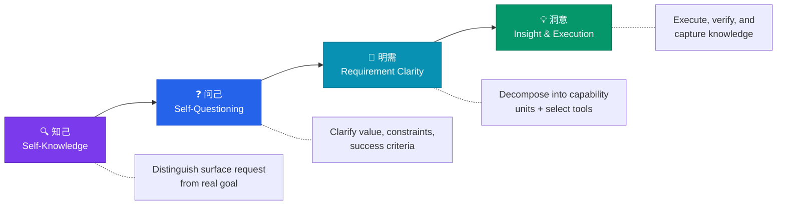

<div align="center">

# ZHIXI - 知悉

### Turn Vague Ideas Into Clear Actions, Leave Traceable Knowledge

**把模糊想法转成清晰行动，并在执行后留下可追溯、可复用的知识**

[](./LICENSE)
[](./CHANGELOG.md)
[](https://docs.qoder.com/qoderwork/introduction)
[](./CONTRIBUTING.md)

[English](#about) | [中文](#关于) | [Quick Start](#quick-start) | [Examples](./examples/)

</div>

---

## About

**ZHIXI (知悉)** is an AI Agent skill that bridges the gap between *what you think you want* and *what you actually need*. It runs a structured four-stage thinking framework that transforms fuzzy requests into actionable plans — while automatically capturing reusable knowledge along the way.

Most AI interactions start with a vague prompt and end with a half-baked answer. ZHIXI changes that by forcing clarity at every step: understanding the real goal, questioning assumptions, decomposing capabilities, and executing with traceable evidence.

**No external API keys. No cloud dependencies. Runs inside your existing AI workspace.**

## 关于

**知悉（ZHIXI）** 是一个 AI Agent 技能，弥合“你以为自己想要的”和“你真正需要的”之间的鸿沟。它运行一套结构化四阶段思维框架，把模糊请求转化为可执行方案——并在过程中自动沉淀可复用的知识。

大多数 AI 对话始于一个模糊提示，终于一个半成品答案。知悉改变了这一点：在每一步强制澄清——理解真实目标、审视假设、拆解能力单元、用可追溯的证据执行。

**无需外部 API Key，无云端依赖，在你现有的 AI 工作空间中运行。**

---

## Core Features

- **Four-Stage Thinking Framework** — Structured flow from understanding to execution, no step skipped
- **Knowledge Capture** — Auto-generates traceable, reusable knowledge fragments with confidence scores
- **Agent-Native** — Designed for multi-agent handoff with full context propagation
- **Zero Dependencies** — No external APIs, no extra keys, works with any LLM
- **Intent Preservation** — Your original request is always preserved verbatim, never silently rewritten
- **Evidence-Based** — Every claim tagged as fact / inference / suggestion with source tracking

---

## How It Works



### Stage 1: 知己 (Self-Knowledge)

Distinguish the surface request from the real goal. Preserve the user's original words. Mark what is stated vs. inferred. Ask at most 1–3 direction-changing questions.

### Stage 2: 问己 (Self-Questioning)

Clarify value and success criteria, constraints and immutables, alternative paths and their costs, verification standards, and the next critical decision. Output a reviewable requirements baseline.

### Stage 3: 明需 (Requirement Clarity)

Decompose the requirements baseline into capability units. Each unit specifies: goal, inputs/outputs, acceptance criteria, available skills/tools/agents, risks, and degradation path. Search GitHub repos as capability sources, not finished products.

### Stage 4: 洞意 (Insight & Execution)

Execute implementation and verification. Produce traceable knowledge fragments distinguishing facts, inferences, suggestions, limitations, and sources. Unverified claims get confidence ≤ 0.6.

---

## Quick Start

### Prerequisites

- [QoderWork](https://docs.qoder.com/qoderwork/introduction) desktop app installed
- Any supported LLM (works with any model your workspace uses)

### Installation

1. Copy the `skill/SKILL.md` file to your QoderWork skills directory:

```bash
# macOS / Linux
cp skill/SKILL.md ~/.qoderworkcn/skills/zhixi/SKILL.md
```

2. That's it. No configuration needed.

### Usage

In any QoderWork conversation, simply say:

> **知悉** — 我想做一个 [你的想法]

Or use the English trigger:

> **zhixi** — I want to build [your idea]

ZHIXI will automatically engage the four-stage framework and walk you through clarity.

### Trigger Words

Any of these will activate ZHIXI: `知悉`, `zhixi`, `知己`, `问己`, `明需`, `洞意`, `四阶段流程`, `知悉式任务拆解`, `把想法变清晰`, `帮我理清思路`, `需求澄清`, `意图分析`

---

## Knowledge Capture

ZHIXI doesn't just help you think clearly — it leaves a trail of reusable knowledge.

### Knowledge Slots (created in Stage 3)

```json
{
  "id": "slot-1-node-id",
  "title": "What we need to know",
  "question": "The single question execution should answer",
  "kind": "procedure",
  "requiredEvidence": ["actual results", "source paths", "boundaries"]
}
```

Supported kinds: `principle`, `procedure`, `decision_rule`, `data_contract`, `verified_finding`, `risk_boundary`, `open_question`

### Knowledge Fragments (created in Stage 4)

Each fragment is a standalone, sanitized Markdown document with YAML frontmatter:

```markdown
---
type: knowledge-fragment
status: candidate
confidence: 0.8
tags:
  - knowledge/fragment
---

# Reusable Title

## Summary
## Facts
## Inferences
## Suggestions
## Applicability Boundaries
## Sources
```

No fabrication. No hallucination. Every claim traced to evidence.

---

## Architecture

```
┌─────────────────────────────────────────────────────────────┐
│                  QoderWork Host Session              │
│                                                     │
│  ┌──────────┐  ┌──────────┐  ┌──────────┐  ┌─────┐│
│  │  知己    │→ │  问己    │→ │  明需    │→ │ 洞意 ││
│  │Zhi Ji    │  │Wen Ji    │  │Ming Xu   │  │Dong ││
│  │          │  │          │  │          │  │ Yi  ││
│  │ Intent   │  │Baseline  │  │Capability│  │Exec ││
│  │Analysis  │  │Review    │  │Decomp.   │  │+KB  ││
│  └──────────┘  └──────────┘  └──────────┘  └─────┘│
│        ↕             ↕             ↕           ↕   │
│  ┌─────────────────────────────────────────────────┐│
│  │            Knowledge Fragment Store              ││
│  └─────────────────────────────────────────────────┘│
└─────────────────────────────────────────────────────┘
```

ZHIXI runs entirely within the host session. It follows the host's chosen model and never calls external services.

---

## Examples

See the [examples/](./examples/) directory for real-world usage:

- [From Vague Idea to Action Plan](./examples/vague-idea-to-action.md) — Transforming a rough product idea into a structured plan
- [Knowledge Fragment Example](./examples/knowledge-fragment-example.md) — What captured knowledge looks like

---

## Why ZHIXI?

| Problem | Without ZHIXI | With ZHIXI |
|---------|--------------|------------|
| Vague prompts | AI guesses, you retry 5 times | Structured clarification in one pass |
| Lost context | Each conversation starts from scratch | Knowledge fragments carry forward |
| Unverified claims | AI states things as facts | Every claim tagged: fact / inference / suggestion |
| Agent handoff | Critical context gets dropped | Full context, constraints, and verification steps included |
| Scope creep | No clear non-goals | Requirements baseline explicitly states what's out of scope |

---

## Contributing

Contributions are welcome! See [CONTRIBUTING.md](./CONTRIBUTING.md) for details.

### How to Contribute

1. Fork the repo
2. Create a branch: `git checkout -b feature/my-improvement`
3. Make your changes and commit: `git commit -m "Improve: add example for multi-agent handoff"`
4. Push: `git push origin feature/my-improvement`
5. Open a Pull Request

### Areas We Need Help With

- More real-world examples and use cases
- Translations (Japanese, Korean, Spanish, etc.)
- Integration guides for other AI agent frameworks
- Visual diagrams and documentation improvements

---

## Roadmap

- [ ] v1.1 — Add multi-language support for knowledge fragment templates
- [ ] v1.2 — Create visual workflow builder for the four stages
- [ ] v1.3 — Integration with popular AI agent frameworks (LangChain, CrewAI, AutoGen)
- [ ] v2.0 — Knowledge graph: connect fragments into a searchable knowledge base

---

## FAQ

**Q: Does ZHIXI work with any LLM?**
A: Yes. ZHIXI is a prompt-level skill — it works with any model your AI workspace supports.

**Q: Does it send data to external servers?**
A: No. Everything runs locally in your session. Zero external dependencies.

**Q: Can I use it outside QoderWork?**
A: The SKILL.md is a structured prompt. You can adapt it for other AI frameworks, but it's designed and tested for QoderWork.

**Q: What's the difference between ZHIXI and just asking AI to "think step by step"?**
A: ZHIXI enforces a specific four-stage structure, preserves your original intent, captures knowledge fragments, and handles agent handoff — it's a complete methodology, not just a prompt trick.

---

## License

This project is licensed under the Apache License 2.0 — see the [LICENSE](./LICENSE) file for details.

---

<div align="center">

**Made with clarity in mind.**

If ZHIXI helped you think more clearly, give this repo a star!

[Report Bug](https://github.com/tensely0228/ZHIXI/issues) · [Request Feature](https://github.com/tensely0228/ZHIXI/issues)

</div>
