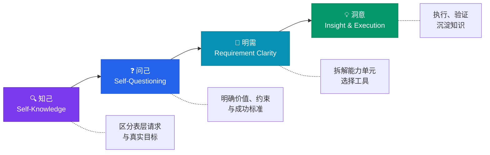

<div align="center">

# 知悉 ZHIXI

### 把模糊想法转成清晰行动，留下可追溯、可复用的知识

**Turn Vague Ideas Into Clear Actions, Leave Traceable Knowledge**

[](./LICENSE)
[](./CHANGELOG.md)
[](https://docs.qoder.com/qoderwork/introduction)
[](./CONTRIBUTING.md)

[中文](#关于) | [English](#english) | [快速开始](#快速开始) | [示例](./examples/)

</div>

---

## 关于

**知悉（ZHIXI）** 是一个 AI Agent 技能，弥合“你以为自己想要的”和“你真正需要的”之间的鸿沟。它运行一套结构化四阶段思维框架，把模糊请求转化为可执行方案——并定义了一套知识沉淀格式，帮助你留下可复用的知识。

大多数 AI 对话始于一个模糊提示，终于一个半成品答案。知悉改变了这一点：在每一步强制澄清——理解真实目标、审视假设、拆解能力单元、用可追溯的证据执行。

**无需额外 API Key，无额外依赖，在你现有的 QoderWork 会话中运行。**

---

## 核心特性

- **四阶段思维框架** — 从理解到执行的结构化流程，不跳过任何步骤
- **知识沉淀格式** — 定义了可追溯、可复用的知识碎片格式及置信度评分（存储基础设施由用户自建）
- **Agent 协作感知** — 包含多 Agent 交接指引
- **零额外依赖** — 不需要额外的 API、不需要额外的密钥，适配工作空间支持的任何 LLM
- **意图保留** — 你的原始请求始终原样保留，不会被悄悄改写
- **证据导向** — 每个结论标记为事实 / 推断 / 建议，并追踪来源

---

## 工作原理



### 第一阶段：知己

区分表层请求与真实目标。原样保留用户的原话。标记哪些是已陈述的、哪些是推断的。最多问 1–3 个能改变方向的关键问题。

### 第二阶段：问己

明确价值和成功标准、约束和不可变条件、替代路径及其代价、验证标准，以及下一项关键决策。输出一份可审阅的需求基线。

### 第三阶段：明需

把需求基线拆解为能力单元。每个单元包含：目标、输入/输出、验收标准、可用的 Skill/工具/Agent、风险和降级路径。把 GitHub 仓库视为能力来源，而非成品。

### 第四阶段：洞意

执行实现与验证。产出可追溯的知识碎片，严格区分事实、推断、建议、限制和来源。未经核验的结论置信度不超过 0.6。

---

## 快速开始

### QoderWork 是什么？

如果你是第一次接触，[QoderWork](https://docs.qoder.com/qoderwork/introduction) 是一款运行在本地的桌面 AI 助手应用。知悉是 QoderWork 的一个“技能”——可以理解为一种结构化方法论插件，增强 AI 思考和拆解问题的方式。

### 前置要求

- 已安装 [QoderWork](https://docs.qoder.com/qoderwork/introduction) 桌面端（macOS 或 Windows）
- 工作空间中配置了任意 LLM（知悉适配你使用的任何模型）

### 安装

1. 将 `skill/SKILL.md` 复制到 QoderWork 技能目录：

```bash
# macOS / Linux
mkdir -p ~/.qoderworkcn/skills/zhixi
cp skill/SKILL.md ~/.qoderworkcn/skills/zhixi/SKILL.md
```

```powershell
# Windows (PowerShell)
New-Item -ItemType Directory -Force -Path "$env:USERPROFILE\.qoderworkcn\skills\zhixi"
Copy-Item "skill\SKILL.md" "$env:USERPROFILE\.qoderworkcn\skills\zhixi\SKILL.md"
```

2. 完成。无需任何配置。

### 使用方式

在任意 QoderWork 对话中，直接说：

> **知悉** — 我想做一个 [你的想法]

也可以用英文触发：

> **zhixi** — I want to build [your idea]

知悉会自动启动四阶段框架，带你一步步理清思路。

### 触发词

以下任意关键词均可激活知悉：`知悉`、`zhixi`、`知己`、`问己`、`明需`、`洞意`、`四阶段流程`、`知悉式任务拆解`、`把想法变清晰`、`帮我理清思路`、`需求澄清`、`意图分析`

---

## 知识沉淀

知悉定义了知识沉淀的格式规范——它规定知识碎片**应该长什么样**，但不负责**存在哪里**。

> **重要说明：** 知悉是一套方法论和格式规范。它**不包含**内置的知识存储引擎、数据库或搜索系统。知识碎片格式的设计目标是让你用自建或自选的基础设施来存储、索引和查询。

### 知识槽位（第三阶段生成）

```json
{
  "id": "slot-1-node-id",
  "title": "需要知道什么",
  "question": "执行完成后需要回答的单一问题",
  "kind": "procedure",
  "requiredEvidence": ["实际执行结果", "来源或文件路径", "适用边界"]
}
```

支持的 `kind` 类型：`principle`、`procedure`、`decision_rule`、`data_contract`、`verified_finding`、`risk_boundary`、`open_question`

### 知识碎片（第四阶段生成）

每个碎片是一份独立的、脱敏的 Markdown 文档，带 YAML 前言：

```markdown
---
type: knowledge-fragment
status: candidate
privacy: sanitized
source: "来源 URL 或描述"
confidence: 0.8
tags:
  - knowledge/fragment
---

# 可独立复用的标题

## 摘要
## 事实陈述
## 推断
## 建议
## 适用边界
## 来源
```

不捏造，不幻觉，每个结论追溯证据。

### 自建知识库

碎片格式的设计特点：

- **文件化** — 每个碎片是独立的 Markdown 文件，可以存在任何地方
- **可检索** — YAML 前言支持任何文本搜索工具索引
- **可迁移** — 在系统间迁移碎片时不产生锁定

你可以把碎片存在 Git 仓库、笔记应用、静态站点中，或者在其上构建自定义搜索索引。格式始终不变。

---

## 架构

```
┌─────────────────────────────────────────────────────┐
│                  QoderWork 宿主会话                   │
│                                                     │
│  ┌──────────┐  ┌──────────┐  ┌──────────┐  ┌─────┐│
│  │  知己    │→ │  问己    │→ │  明需    │→ │ 洞意 ││
│  │          │  │          │  │          │  │     ││
│  │ 意图分析  │  │ 需求基线  │  │ 能力拆解  │  │执行  ││
│  │          │  │          │  │          │  │+知识 ││
│  └──────────┘  └──────────┘  └──────────┘  └─────┘│
│        ↕             ↕             ↕           ↕   │
│  ┌─────────────────────────────────────────────────┐│
│  │          知识碎片格式输出                         ││
│  │       （存储基础设施：用户自建）                    ││
│  └─────────────────────────────────────────────────┘│
└─────────────────────────────────────────────────────┘
```

知悉完全在宿主会话内运行，跟随宿主选择的模型，不调用任何外部服务。

---

## 示例

查看 [examples/](./examples/) 目录了解真实用法：

- [从模糊想法到行动方案](./examples/vague-idea-to-action.md) — 把一个粗略的产品想法转化为结构化方案
- [知识碎片示例](./examples/knowledge-fragment-example.md) — 沉淀出的知识碎片长什么样

---

## 知悉适合你吗？

知悉适合需要对复杂、多步骤问题进行结构化思考的场景。以下情况可能**不太合适**：

- 你需要快速的一句话事实回答——直接问 AI 就好
- 你的工作流不需要显式的需求拆解
- 你在找一个全自动的知识管理系统（知悉定义格式，基础设施需要自建）

### 为什么选择知悉？

| 痛点 | 没有知悉 | 用知悉 |
|------|---------|-------|
| 提示模糊 | AI 靠猜，你重试 5 遍 | 一次结构化澄清 |
| 上下文丢失 | 每次对话从零开始 | 知识碎片跨会话延续 |
| 未核验结论 | AI 把推断当事实说 | 每个结论标记：事实 / 推断 / 建议 |
| Agent 交接 | 关键上下文丢失 | 交接指引一并传递 |
| 范围蔓延 | 没有明确的非目标 | 需求基线写明什么不做 |

---

## 参与贡献

欢迎贡献！详见 [CONTRIBUTING.md](./CONTRIBUTING.md)。

### 如何贡献

1. Fork 本仓库
2. 创建分支：`git checkout -b feature/my-improvement`
3. 提交改动：`git commit -m "Improve: add example for multi-agent handoff"`
4. 推送：`git push origin feature/my-improvement`
5. 发起 Pull Request

### 我们需要帮助的领域

- 更多真实场景的用例和示例
- 其他语言翻译（日语、韩语、西班牙语等）
- 其他 AI Agent 框架的集成指南
- 可视化图表和文档改进

---

## 路线图

- [ ] v1.1 — 知识碎片模板多语言支持
- [ ] v1.2 — 四阶段可视化工作流构建器
- [ ] v1.3 — 集成主流 AI Agent 框架（LangChain、CrewAI、AutoGen）
- [ ] v2.0 — 知识图谱：将碎片连接为可检索的知识库

---

## 常见问题

**Q: 知悉支持所有 LLM 吗？**
A: 是的。知悉是提示词层面的技能，适配你 QoderWork 工作空间支持的任何模型。

**Q: 会向外部服务器发送数据吗？**
A: 不会。一切在你的 QoderWork 会话中本地运行，无额外外部依赖。

**Q: 可以在 QoderWork 之外使用吗？**
A: SKILL.md 是一份结构化提示词。你可以将其适配到其他 AI 框架，但它针对 QoderWork 设计和测试。

**Q: 知悉和让 AI“一步步思考”有什么区别？**
A: 知悉强制执行特定的四阶段结构、保留你的原始意图、提供知识碎片格式、包含 Agent 交接指引——它是完整的方法论，不只是提示词技巧。

**Q: 知悉会自动存储和管理我的知识碎片吗？**
A: 不会。知悉定义知识沉淀的格式和方法论。存储、索引和检索基础设施由你自行搭建。把它看作规范，不是产品。

---

## 许可证

本项目基于 Apache License 2.0 开源 — 详见 [LICENSE](./LICENSE)。

---

<a id="english"></a>

## English

<details>
<summary>Click to expand English summary</summary>

**ZHIXI (知悉)** is an AI Agent skill for [QoderWork](https://docs.qoder.com/qoderwork/introduction) that transforms vague requests into actionable plans through a four-stage thinking framework:

1. **知己 (Self-Knowledge)** — Distinguish surface request from real goal
2. **问己 (Self-Questioning)** — Clarify value, constraints, success criteria
3. **明需 (Requirement Clarity)** — Decompose into capability units + select tools
4. **洞意 (Insight & Execution)** — Execute, verify, and capture knowledge

**Key features:** Zero additional dependencies, evidence-based reasoning (every claim tagged as fact/inference/suggestion), intent preservation, agent handoff guidelines, and a structured knowledge fragment format with confidence scoring.

**Important:** ZHIXI is a methodology and format specification. It does not include built-in knowledge storage — the fragment format is designed for user-provided infrastructure.

**Quick start:** Install QoderWork, copy `skill/SKILL.md` to `~/.qoderworkcn/skills/zhixi/`, then say "知悉" or "zhixi" in any conversation.

</details>

---

<div align="center">

**为清晰而生。**

如果知悉帮你理清了思路，给这个仓库一颗 Star 吧！

[报告问题](https://github.com/tensely0228/ZHIXI/issues/new?template=bug-report.md) · [功能建议](https://github.com/tensely0228/ZHIXI/issues/new?template=feature-request.md)

</div>
